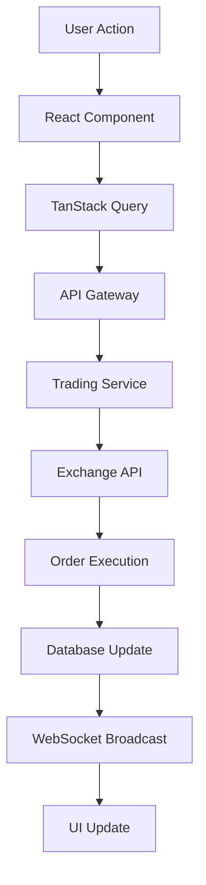
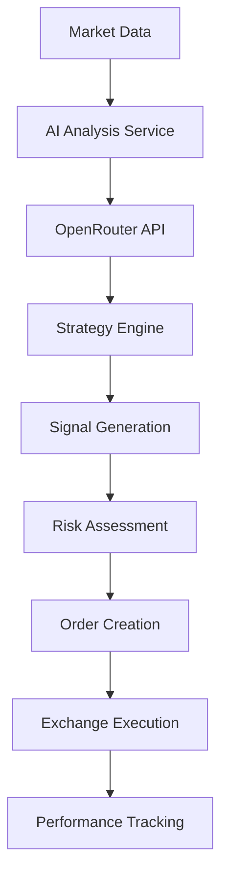

# 🏗️ Technical Architecture Overview

**Version**: 2.0  
**Last Updated**: January 25, 2025  
**Status**: Production Ready  

---

## 🎯 System Overview

The Advanced Crypto Trading Platform is a full-stack web application built with modern technologies, providing real-time cryptocurrency trading capabilities with AI-powered automation.

### Core Architecture Principles
- **Microservices Approach**: Modular service architecture
- **Real-time First**: WebSocket-based live data streaming
- **API-First Design**: RESTful APIs with comprehensive documentation
- **Security by Design**: End-to-end encryption and secure storage
- **Scalable Infrastructure**: Cloud-native deployment architecture

---

## 🛠️ Technology Stack

### Frontend Layer
```typescript
Framework: React 18 + TypeScript
Build Tool: Vite 5.x
UI Library: Shadcn/UI + TailwindCSS
State Management: React Context + TanStack Query
Charts: Recharts + Nivo
Icons: Lucide React
Styling: TailwindCSS with CSS Variables
```

### Backend Layer
```typescript
Database: Supabase PostgreSQL
Authentication: Supabase Auth
Real-time: Supabase Realtime
Edge Functions: Supabase Edge Functions
File Storage: Supabase Storage
API Layer: RESTful + GraphQL
```

### External Integrations
```typescript
AI Models: OpenRouter (GPT-4, Claude, DeepSeek R1, Gemini 2)
Market Data: CoinGecko, Binance, CryptoCompare
Blockchain: Algorand (Nodely API)
Automation: N8N Workflow Engine
Exchanges: Binance, Coinbase, Kraken, Bybit, OKX, KuCoin
```

---

## 📊 System Architecture Diagram

```
┌─────────────────────────────────────────────────────────┐
│                    CLIENT LAYER                         │
├─────────────────────────────────────────────────────────┤
│  React App (SPA)  │  Mobile PWA  │  Desktop Electron    │
│  - Trading UI     │  - Simplified │  - Advanced Tools   │
│  - Real-time      │  - Touch      │  - Multi-monitor    │
│  - Responsive     │  - Offline    │  - Hotkeys         │
└─────────────────────────────────────────────────────────┘
                              │
                              ▼
┌─────────────────────────────────────────────────────────┐
│                   API GATEWAY                           │
├─────────────────────────────────────────────────────────┤
│  Load Balancer  │  Rate Limiting  │  Authentication     │
│  - Traffic Dist │  - API Quotas   │  - JWT Tokens      │
│  - SSL Term     │  - DDoS Protect │  - Role Based      │
└─────────────────────────────────────────────────────────┘
                              │
                              ▼
┌─────────────────────────────────────────────────────────┐
│                 MICROSERVICES LAYER                     │
├─────────────────────────────────────────────────────────┤
│ Trading Service │ AI Service    │ Market Data Service   │
│ - Order Mgmt    │ - Strategies  │ - Real-time Feeds    │
│ - Portfolio     │ - Signals     │ - Historical Data    │
│ - Risk Mgmt     │ - Backtesting │ - Price Aggregation  │
├─────────────────────────────────────────────────────────┤
│ User Service    │ Notification  │ Analytics Service    │
│ - Profiles      │ - Alerts      │ - Performance        │
│ - Settings      │ - Multi-chan  │ - Reporting          │
│ - Preferences   │ - Real-time   │ - Tax Calculations   │
└─────────────────────────────────────────────────────────┘
                              │
                              ▼
┌─────────────────────────────────────────────────────────┐
│                   DATA LAYER                            │
├─────────────────────────────────────────────────────────┤
│ PostgreSQL      │ Redis Cache   │ Time Series DB       │
│ - User Data     │ - Sessions    │ - Price History      │
│ - Transactions  │ - Real-time   │ - Trading Metrics    │
│ - Configurations│ - API Cache   │ - Performance Data   │
└─────────────────────────────────────────────────────────┘
                              │
                              ▼
┌─────────────────────────────────────────────────────────┐
│               EXTERNAL INTEGRATIONS                     │
├─────────────────────────────────────────────────────────┤
│ Exchanges       │ AI Providers  │ Blockchain Networks  │
│ - Binance       │ - OpenRouter  │ - Algorand          │
│ - Coinbase      │ - Local AI    │ - Ethereum          │
│ - Kraken        │ - Custom      │ - Bitcoin           │
└─────────────────────────────────────────────────────────┘
```

---

## 🔄 Data Flow Architecture

### Real-time Trading Flow


### AI Trading Decision Flow


---

## 📂 Project Structure

```
src/
├── components/                 # React Components
│   ├── analytics/             # Analytics & reporting
│   ├── api/                   # API management
│   ├── auth/                  # Authentication
│   ├── dashboard/             # Dashboard layouts
│   ├── news/                  # News & sentiment
│   ├── settings/              # Configuration
│   ├── tax/                   # Tax tools
│   ├── trading/               # Trading interfaces
│   ├── ui/                    # Base UI components
│   └── wallets/               # Wallet integration
├── contexts/                  # React Contexts
│   ├── AuthContext.tsx        # Authentication state
│   ├── ThemeContext.tsx       # Theme management
│   ├── CurrencyContext.tsx    # Currency conversion
│   └── TradingContext.tsx     # Trading state
├── hooks/                     # Custom React hooks
│   ├── useAuth.ts            # Authentication hook
│   ├── useRealTimeData.ts    # Real-time data
│   ├── useTradingBot.ts      # AI bot management
│   └── usePortfolio.ts       # Portfolio tracking
├── services/                  # Business logic
│   ├── ai/                   # AI trading services
│   ├── api/                  # External APIs
│   ├── automation/           # N8N integration
│   ├── exchanges/            # Exchange connectors
│   └── algorand/             # Blockchain services
├── types/                     # TypeScript definitions
│   ├── trading.d.ts          # Trading interfaces
│   ├── api.d.ts              # API responses
│   └── ui.d.ts               # UI component types
├── utils/                     # Helper functions
│   ├── constants.ts          # Application constants
│   ├── formatters.ts         # Data formatting
│   ├── validators.ts         # Input validation
│   └── crypto.ts             # Encryption utilities
└── docs/                      # Documentation
    ├── api/                  # API documentation
    ├── guides/               # User guides
    └── architecture/         # Technical docs
```

---

## 🔌 API Architecture

### RESTful API Design
```typescript
// Base API Structure
/api/v1/
├── auth/                     # Authentication endpoints
│   ├── POST /login          # User login
│   ├── POST /register       # User registration
│   ├── POST /refresh        # Token refresh
│   └── POST /logout         # User logout
├── trading/                  # Trading operations
│   ├── GET /portfolio       # Portfolio data
│   ├── POST /orders         # Create order
│   ├── GET /orders/:id      # Order details
│   └── DELETE /orders/:id   # Cancel order
├── bots/                     # AI trading bots
│   ├── GET /bots           # List bots
│   ├── POST /bots          # Create bot
│   ├── PUT /bots/:id       # Update bot
│   └── DELETE /bots/:id    # Delete bot
├── market/                   # Market data
│   ├── GET /prices         # Current prices
│   ├── GET /history        # Historical data
│   ├── GET /correlations   # Asset correlations
│   └── GET /sentiment      # Market sentiment
└── analytics/                # Analytics & reporting
    ├── GET /performance    # Performance metrics
    ├── GET /risk          # Risk analysis
    └── GET /tax           # Tax calculations
```

### WebSocket API
```typescript
// Real-time Data Streams
ws://api.platform.com/v1/
├── prices                    # Real-time price updates
├── orders                    # Order status updates
├── portfolio                 # Portfolio changes
├── bots                      # Bot activity
└── alerts                    # System alerts
```

---

## 🛡️ Security Architecture

### Authentication & Authorization
```typescript
// JWT Token Structure
{
  "sub": "user_id",
  "iat": timestamp,
  "exp": timestamp,
  "scope": ["trading", "analytics", "admin"],
  "role": "trader | premium | admin"
}

// Role-Based Permissions
const permissions = {
  trader: ["read:portfolio", "write:orders"],
  premium: ["read:portfolio", "write:orders", "read:analytics"],
  admin: ["*"]
}
```

### Data Encryption
- **At Rest**: AES-256 encryption for sensitive data
- **In Transit**: TLS 1.3 for all API communications
- **API Keys**: Encrypted storage with HSM integration
- **User Data**: GDPR compliant data handling

---

## 📈 Performance Architecture

### Optimization Strategies
1. **Code Splitting**: Lazy loading of route components
2. **Caching**: Multi-level caching strategy
3. **CDN**: Global content delivery network
4. **Compression**: Gzip/Brotli compression
5. **Bundle Optimization**: Tree shaking and minification

### Monitoring & Observability
```typescript
// Performance Metrics
const metrics = {
  apiResponseTime: "<200ms",
  pageLoadTime: "<2s",
  webSocketLatency: "<50ms",
  databaseQueryTime: "<100ms",
  cacheHitRatio: ">90%"
}
```

---

## 🚀 Deployment Architecture

### Infrastructure Components
- **Frontend**: CDN-hosted static assets
- **Backend**: Containerized microservices
- **Database**: Managed PostgreSQL cluster
- **Cache**: Redis cluster for session storage
- **Load Balancer**: Application load balancer
- **Monitoring**: Comprehensive observability stack

### Environment Strategy
```
Development → Staging → Production
     ↓           ↓          ↓
   Local      Preview    Live
   Testing    Testing   Users
```

---

## 🔄 Continuous Integration/Deployment

### CI/CD Pipeline
```yaml
# GitHub Actions Workflow
stages:
  - lint_and_test
  - security_scan
  - build_artifacts
  - deploy_staging
  - run_e2e_tests
  - deploy_production
  - post_deploy_tests
```

---

**This architecture supports high availability, scalability, and maintainability while ensuring security and performance requirements are met.**
